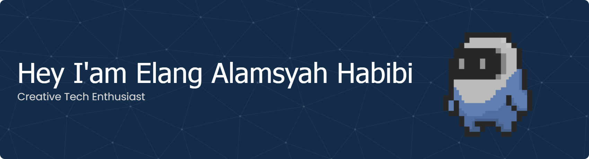

  

###

<h1 align="left">💫 About Me:</h1>

###

I'm a Creative Tech Enthusiast who loves blending technology with creativity.  Currently, I'm focusing on: - **Web Front-End Development (HTML, CSS, JavaScript)** - **Pixel Art 3D Modelling** - **Exploring other creative fields in tech and design**  I enjoy turning ideas into something visual and interactive, whether it's through clean and modern web interfaces or expressive pixel art.

###

## 🌐 Socials:
     

###

## 💻 Tech Stack:
                

###

  
  

###

<picture>
  <source media="(prefers-color-scheme: dark)" srcset="https://raw.githubusercontent.com/elanghabibi/elanghabibi/output/pacman-contribution-graph-dark.svg">
  <source media="(prefers-color-scheme: light)" srcset="https://raw.githubusercontent.com/elanghabibi/elanghabibi/output/pacman-contribution-graph.svg">
  
</picture>

###

  

###
